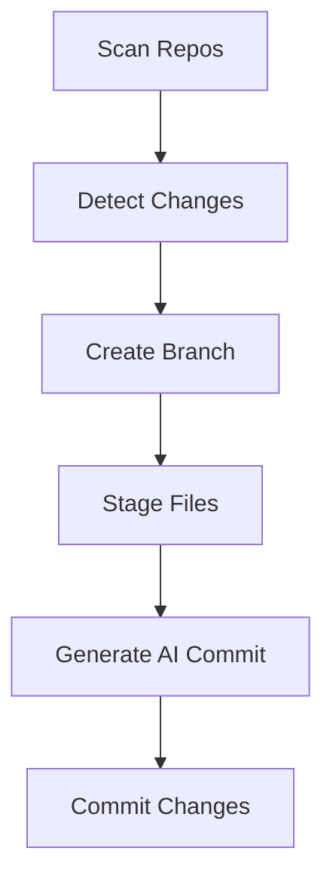

# 🚀 Auto Git Committer

<p align="center">
  <b>AI-powered Git automation that commits your work for you — daily.</b><br/>
  Stop writing commit messages. Start shipping faster.
</p>

---

<p align="center">
  
  
  
  
</p>

---

## ⚡ What is this?

**Auto Git Committer** is a lightweight automation tool that:

* Scans your local repositories
* Detects changes
* Creates a new branch (based on date)
* Generates **AI-powered commit messages**
* Commits everything — automatically

> Set it once → schedule it → forget it.

---

## 🔥 Demo

```bash
$ node dist/index.js

🔍 Checking repo: encoder
🌿 Created branch: ai/2026-04-03
🤖 Generated message: feat(readme): update documentation content
✅ Committed successfully
```

---

## ✨ Features

* 🤖 AI-generated **clean conventional commits**
* 🌿 Automatic branch creation (`ai/YYYY-MM-DD`)
* 🔍 Smart change detection
* 📦 Auto stage & commit
* ⏰ Schedule once → runs daily
* ⚡ Multi-repo support

---

## 🧠 How It Works



---

## 📦 Installation

```bash
git clone https://github.com/your-username/auto-git
cd auto-git
npm install
```

---

## ⚙️ Configuration

### 1. Add your API key

Create `.env` file:

```env
OPEN_ROUTER_KEY=your_api_key_here
```

---

### 2. Add your repositories

Edit:

```
src/config/repo.ts
```

```ts
export const repos = [
  {
    path: "C:/Users/yourname/projects/project1",
  },
  {
    path: "C:/Users/yourname/projects/project2",
  },
];
```

---

## 🛠 Build

```bash
npm run build
```

---

## ▶️ Run

```bash
node dist/index.js
```

---

## ⏰ Automate (Run Daily at 11 PM)

### 🪟 Windows (Recommended)

1. Open **Task Scheduler**
2. Create Basic Task
3. Trigger → Daily → 11:00 PM
4. Action:

   * Program: `node`
   * Arguments:

     ```
     C:\path\to\project\dist\index.js
     ```
   * Start in:

     ```
     C:\path\to\project
     ```

---

### 🐧 Linux / Mac (Cron)

```bash
crontab -e
```

```bash
0 23 * * * node /path/to/project/dist/index.js
```

---

## 🧪 Example Commit Output

```bash
feat(auth): implement JWT authentication
fix(api): resolve null response crash
refactor(core): simplify commit pipeline
chore(readme): update documentation
```

---

## ⚠️ Important Notes

* 🔐 Keep your API key secure
* ⚠️ Free AI models may rate limit
* 🧠 Works best with meaningful code diffs
* 🧪 Test on non-critical repos first

---

## 🚀 Roadmap

* [ ] Auto push to GitHub
* [ ] Pull request generation
* [ ] Smart commit classification
* [ ] CLI tool (`npx auto-git`)
* [ ] GitHub Actions integration

---

## 🤝 Contributing

PRs are welcome.
If you’re building something cool on top of this — contribute.

---

## ⭐ Support

If this helped you:

* Star the repo
* Share with devs
* Build on top of it

---

## 🧾 License

MIT License

---

## 🧠 Final Thought

> The best code is the code you don’t have to think about.

This tool removes one more thing from your workflow.
